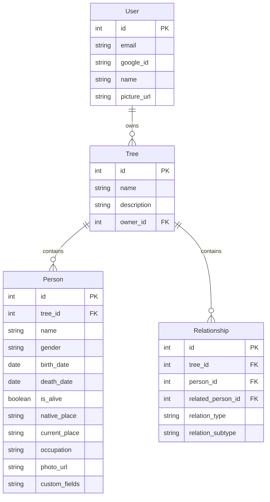

# Implementation Plan - Family Tree Web Application

This document outlines the architecture and implementation steps to build the Family Tree Builder application. It is designed to be mobile-first but responsive and premium on desktop, utilizing Next.js (frontend) and FastAPI (backend) within the same repository.

## Proposed Stack and Architectural Decisions

* **Frontend**: Next.js + React + TypeScript + Tailwind CSS + shadcn/ui.
  * **Visualization**: **React Flow** to render interactive, draggable nodes and connections.
  * **Auto-Layout**: **@dagrejs/dagre** to automatically arrange nodes hierarchically (parents above children, spouses adjacent).
* **Backend**: FastAPI (Python) for standard performance, fast endpoints, and clean async patterns.
* **Database**: **SQLite** for zero-setup local development, with models defined via **SQLModel** (SQLAlchemy). Since SQLModel interfaces with standard SQL database drivers, transitioning to **Neon PostgreSQL** for production is as simple as switching the `DATABASE_URL` environment variable.
* **Storage (Photos)**: **Cloudinary** will be used exclusively for both local development and production. Uploaded photos are stored directly in Cloudinary, returning secure CDN links to be stored in the database.
* **Dynamic Custom Fields**: Standard attributes (name, birthDate, alive, nativePlace, currentPlace, occupation) will be first-class columns. In addition, the `Person` model will contain a JSON-compatible string field `custom_fields` to support user-generated attributes.

---

## Database Schema (SQLModel)



> [!NOTE]
> ### Review Comments & Design Explanations
>
> 1. **Authentication (Google OAuth only)**: We do not need to store passwords since we will authenticate using Google OAuth (JWT tokens signed by our backend on successful Google verification). The `User` table now contains `google_id` instead of `hashed_password`.
> 2. **Relation Connections**:
>    * `Tree` contains `Relationship` records (which belongs to a specific family tree).
>    * A `Relationship` record joins two `Person` records in the database: `person_id` (representing the source person, e.g. parent) and `related_person_id` (representing the target, e.g. child).
>    * By storing the relationships this way, they can always be edited or deleted dynamically. Sibling relations are dynamically computed when two people share parents.
> 3. **SQLite Concurrency & `check_same_thread: False`**:
>    * Python's standard `sqlite3` driver restricts connection objects to the thread that initialized them. Since FastAPI runs requests concurrently across a thread pool, sharing connections would cause driver crashes without this override.
>    * SQLite handles concurrent writes safely at the database-file level using standard locks (preventing database corruption).
>    * In our backend, using FastAPI's dependency injection (`get_session`) yields a new session and separate transaction for each discrete HTTP request. This avoids sharing session state and prevents connection-level race conditions.
>    * This setting is a SQLite-driver-specific workaround; production Neon PostgreSQL runs as a client-server DB and does not use or need it.

---

## Proposed Changes

### Backend Setup

#### [NEW] [requirements.txt](file:///d:/Moved%20from%20C/Masai/Masai%20Projects/fam-tree/backend/requirements.txt)
Python requirements including:
* `fastapi`, `uvicorn`
* `sqlmodel` (SQLAlchemy wrapper)
* `pyjwt[crypto]`, `cryptography` (OAuth token validations & JWT issue)
* `python-multipart` (For file uploads)
* `httpx` (To verify Google OAuth tokens)

#### [NEW] [db.py](file:///d:/Moved%20from%20C/Masai/Masai%20Projects/fam-tree/backend/app/db.py)
Database engine creation and session generator. Supports SQLite (with thread locks loosened for development) or PostgreSQL URL depending on environment variables.

#### [NEW] [models.py](file:///d:/Moved%20from%20C/Masai/Masai%20Projects/fam-tree/backend/app/models.py)
SQLModel entities matching the schema. Custom serialization helpers for `custom_fields`.

#### [NEW] [routes](file:///d:/Moved%20from%20C/Masai/Masai%20Projects/fam-tree/backend/app/routes/)
* `auth.py`: JWT exchange with ID token validation from Google.
* `trees.py`: CREATE, READ, DELETE trees.
* `people.py`: CREATE, UPDATE, DELETE person nodes.
* `relationships.py`: CREATE, DELETE connections (spouse, parent-child).

#### [NEW] [main.py](file:///d:/Moved%20from%20C/Masai/Masai%20Projects/fam-tree/backend/app/main.py)
FastAPI application core. Configures CORS (to permit local Next.js client access), handles file upload folders, and registers endpoints.

---

### Frontend Setup

#### [NEW] [frontend initialization](file:///d:/Moved%20from%20C/Masai/Masai%20Projects/fam-tree/frontend)
Initialize a Next.js application with TypeScript and Tailwind CSS.
Inject shadcn/ui components (`Sheet`, `Dialog`, `Button`, `Input`, `Dropdown`, `Avatar`).

#### [NEW] [tree-canvas.tsx](file:///d:/Moved%20from%20C/Masai/Masai%20Projects/fam-tree/frontend/src/components/tree-canvas.tsx)
Integrates React Flow with `@dagrejs/dagre` auto-layout:
* Nodes are represented by custom `PersonCard` components.
* Edges are styled based on parent-child / spouse subtypes.
* **Disconnected Subgraph Detection**: Client-side BFS/DFS decomposes nodes into:
  1. **Main Tree** (renders in canvas).
  2. **Partial Trees** (visualized in sidebar tabs).
  3. **Unconnected People** (visualized in sidebar pooling decks).
* Supporting quick-merging actions to draw lines or link relations to join sub-clusters.
* Standard Panning, Zooming, mouse double-click handlers, and a fullscreen cold-start loader backdrop (spinning and cycling family quotes) to hide Render/Railway container wake-up delays.

#### [NEW] [person-drawer.tsx](file:///d:/Moved%20from%20C/Masai/Masai%20Projects/fam-tree/frontend/src/components/person-drawer.tsx)
A mobile-first detail card using a Radix UI Sheet:
* Slide-up menu on mobile screens, slide-in from right on desktop.
* View and edit person details (Base info + Photo upload).
* Dynamic "Add Custom Attribute" interface to add dynamic key-value properties.
* Relationship building shortcuts (e.g. "Add Child", "Add Spouse", "Add Parent"). Clicking these automatically triggers node creation + relationship creation.
* Deletion Dialog Alerts: Warning validation interfaces protecting against accidental delete cascades.

---

## Verification Plan

### Automated Verification
We will run automated integration tests to ensure that:
1. Root API returns status status.
2. User login via Google flow (mocked) is successful.
3. Person node creation correctly maps in the DB.

Commands to execute:
* Backend installation and test run:
  ```powershell
  cd backend
  python -m venv venv
  .\venv\Scripts\activate
  pip install -r requirements.txt
  pytest  # (we will write basic verification tests in backend/tests/)
  ```

### Manual Verification
1. Launch Dev environment:
   * Backend: Run `python main.py` in the backend folder.
   * Frontend: Run `npm run dev` in the frontend folder.
2. Open local client in browser.
3. Walkthrough the following flow:
   * Create a new account / Log in with Google.
   * Add a new tree "Grandfather's Family".
   * Add Grandfather node.
   * Add Grandmother node, then link them as spouses.
   * Add Father node as a child of Grandfather.
   * Add details (birthdate, current place, photo) and add a custom field "Favorite Hobby".
   * Verify the layout recalculates cleanly.
